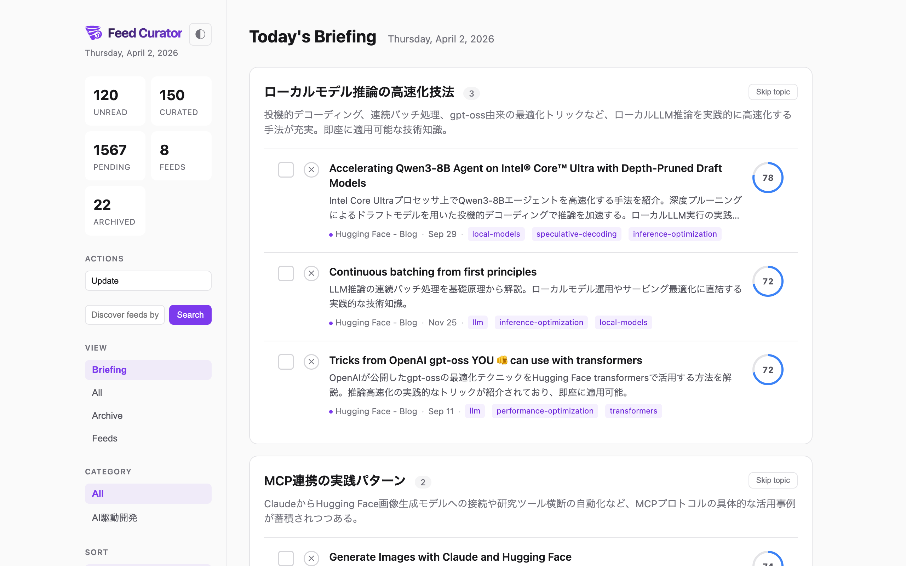
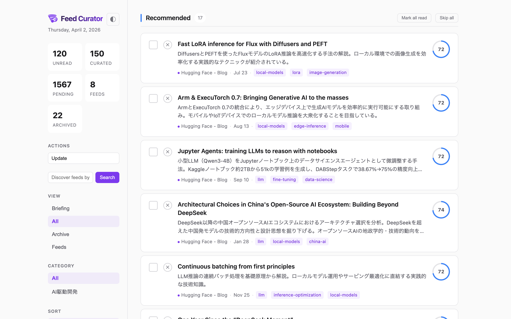
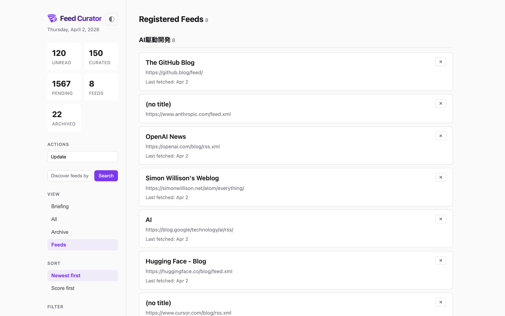

# Feed Curator

Personalized RSS briefings for developers, powered by Claude Code. No separate API keys.

Your reading history trains the curation — the more you read and dismiss, the sharper your daily briefing becomes.

[日本語版は下にあります / Japanese version below](#feed-curator-1)

<p align="center">
  
</p>
<p align="center"><em>Daily Briefing — AI clusters articles by topic and summarizes each group</em></p>

<details>
<summary>More screenshots</summary>

| All Articles | Feed Management |
|:---:|:---:|
|  |  |
| Score-ranked articles with tier grouping | Manage feeds by category |

</details>

---

## Features

- **No API Keys** — Claude Code itself is the AI curator; no separate API key setup required
- **Personalized Scoring** — Learns from your reading history (reads, dismisses) to boost what you care about
- **AI Curation** — Scores relevance (0.0-1.0), writes summaries, assigns topic tags — all in your language
- **Daily Briefing** — AI clusters today's articles by topic with summaries
- **Feed Collection** — Register RSS/Atom feeds by URL or discover them by topic via AI
- **Web UI** — Two-column layout with tier grouping, filters, read/unread tracking, dark/light theme
- **Multi-language** — Summaries and briefings written in your preferred language

## Requirements

- [Node.js](https://nodejs.org/) (v20+)
- [Claude Code](https://docs.anthropic.com/en/docs/claude-code) CLI

## Quick Start

```bash
# Install and start
npx feed-curator serve
# Open http://localhost:3000
```

Or install globally:

```bash
npm install -g feed-curator
feed-curator serve
```

1. Choose your language when prompted on first visit
2. Add feeds — discover by topic in the search box, or load a starter pack:
   ```bash
   npx feed-curator init --starter   # Adds 12 popular dev/AI/security feeds
   ```
3. Click "Update" to fetch articles + AI curate + generate briefing

That's it — the Web UI handles everything. For advanced use, see the CLI commands below.

## CLI Commands

```
feed-curator init --starter            # Load starter feed pack
feed-curator add <url> [-c category]   # Register RSS feed
feed-curator list                      # List registered feeds
feed-curator fetch                     # Fetch articles from all feeds
feed-curator add-article <url>         # Add single article URL
feed-curator articles [--uncurated] [--unread] [--json]
feed-curator update <id> --score <n> --summary "..." [--tags "a,b"]
feed-curator tag <id> <tags>           # Set tags on an article
feed-curator read <id...>              # Mark articles as read
feed-curator unread <id...>            # Mark articles as unread
feed-curator categorize <id> <cat>     # Set feed category
feed-curator profile [--prompt]        # Show reading profile
feed-curator serve [--port 3000]       # Start web UI server
feed-curator config <key> [value]      # Get/set config
```

All commands also work with `npx feed-curator <command>`.

## Web UI

Start with `feed-curator serve` and open http://localhost:3000.

### Views

- **Briefing** — AI-generated daily briefing with topic clusters
- **All** — All articles (curated and uncurated) grouped by tier
- **Archive** — Dismissed and archived articles
- **Feeds** — Manage registered feeds by category

### Features

- **Tier grouping** — Must Read (85-100) / Recommended (70-85) / Worth a Look (50-70) / Low Priority (0-50)
- **Score ring** — Visual score indicator per article
- **One-click actions** — Update (fetch + curate + briefing), or run each step individually
- **Feed discovery** — Enter a topic in the sidebar to discover and add feeds via AI
- **Filters** — Category, read status, tags (combinable, persisted in URL)
- **Read tracking** — Click to read, checkbox toggle, mark-all-read per section, skip/dismiss
- **Dark/Light/Auto theme** — Follows OS by default, or manually toggle (saved to localStorage)
- **Multi-language** — Select your language on first visit; summaries and briefings use it

## How Curation Works

1. **Fetch** — pulls new articles from all registered RSS feeds
2. **Curate** — AI reads uncurated articles and for each one:
   - Scores relevance (0.0-1.0) based on novelty, depth, utility
   - Adjusts scores using your reading profile (preferred/ignored tags)
   - Writes a 2-3 sentence summary in your configured language
   - Assigns 1-3 topic tags
3. **Briefing** — AI clusters today's curated articles by topic with summaries
4. Results appear in the Web UI and a Markdown digest is generated

In the Web UI, the **Update** button runs all three steps in sequence.

## Architecture

```
CLI (Node.js + TypeScript + SQLite)     Web UI (SSE-based)
  Data management                         Update / Fetch / Curate / Briefing
  Feed fetching & parsing                 Feed discovery
  Web UI server (http)                    Read/dismiss/filter management
```

No API keys needed — Claude Code itself is the AI.

## Data

- SQLite database: `data/feed-curator.db` (auto-created, gitignored)
- Digest output: `output/digest-YYYY-MM-DD.md` (gitignored)

## Roadmap

### Next

- [Cross-feed duplicate detection](https://github.com/rizumita/feed-curator/issues/8) — Deduplicate overlapping articles
- [Two-stage curation (fast pass + precision re-rank)](https://github.com/rizumita/feed-curator/issues/9) — Speed up large feed sets
- [Full-text re-curation for promising articles](https://github.com/rizumita/feed-curator/issues/10) — Deeper analysis for top candidates

### Planned

- [Multi-day storyline tracking](https://github.com/rizumita/feed-curator/issues/11) — Follow topics across days
- [Manual preference hints (two-layer preference memo)](https://github.com/rizumita/feed-curator/issues/12) — Tell the AI what you care about explicitly
- [Facet-based similar article recommendations](https://github.com/rizumita/feed-curator/issues/7) — Discover related reads

### Exploring

- [MCP server support](https://github.com/rizumita/feed-curator/issues/13) — Use from Claude Desktop / Claude Code directly
- [Standalone binary distribution](https://github.com/rizumita/feed-curator/issues/14) — Single binary via Bun compile
- [Homebrew tap](https://github.com/rizumita/feed-curator/issues/15) — `brew install feed-curator`

---

# Feed Curator

Claude Codeで動く、APIキー不要の、開発者向けパーソナル技術朝刊。

読んだ記事・スキップした記事から嗜好を学習し、毎日のブリーフィングを最適化します。

<p align="center">
  
</p>
<p align="center"><em>日次ブリーフィング — AIが記事をトピック別にクラスタリングして要約</em></p>

<details>
<summary>その他のスクリーンショット</summary>

| 記事一覧 | フィード管理 |
|:---:|:---:|
|  |  |
| スコア順・ティア別の記事表示 | カテゴリー別のフィード管理 |

</details>

## 特徴

- **APIキー不要** — Claude Code自身がAIキュレーター。別途APIキーの設定は不要
- **パーソナライズ** — 既読・スキップ履歴から学習し、興味のあるトピックのスコアを自動調整
- **AIキュレーション** — 関連度スコア(0.0-1.0)、要約、トピックタグを設定言語で生成
- **日次ブリーフィング** — AIが今日の記事をトピック別にクラスタリングして要約
- **フィード収集** — URLでRSS/Atomフィードを登録、またはトピックでAIが自動検索
- **Web UI** — 2カラムレイアウト、ティア別グループ、フィルター、既読管理、ダーク/ライトテーマ
- **多言語対応** — 要約とブリーフィングを設定した言語で出力

## 必要なもの

- [Node.js](https://nodejs.org/) (v20+)
- [Claude Code](https://docs.anthropic.com/en/docs/claude-code) CLI

## クイックスタート

```bash
# インストールして起動
npx feed-curator serve
# http://localhost:3000 を開く
```

またはグローバルインストール:

```bash
npm install -g feed-curator
feed-curator serve
```

1. 初回アクセス時に言語を選択
2. フィードを追加 — 検索ボックスでトピック検索、またはスターターパックを読み込み:
   ```bash
   npx feed-curator init --starter   # 開発/AI/セキュリティの人気フィード12件を追加
   ```
3. 「Update」ボタンで記事取得 → AIキュレーション → ブリーフィング生成を一括実行

Web UIですべて完結します。高度な使い方はCLIコマンドを参照してください。

## CLIコマンド

```
feed-curator init --starter             # スターターフィードパックを読み込み
feed-curator add <url> [-c カテゴリー]  # RSSフィード登録
feed-curator list                       # 登録フィード一覧
feed-curator fetch                      # 全フィードから記事取得
feed-curator add-article <url>          # 単独記事URL追加
feed-curator articles [--uncurated] [--unread] [--json]
feed-curator update <id> --score <n> --summary "..." [--tags "a,b"]
feed-curator tag <id> <tags>            # 記事にタグ設定
feed-curator read <id...>               # 既読にする
feed-curator unread <id...>             # 未読に戻す
feed-curator categorize <id> <cat>      # フィードのカテゴリー設定
feed-curator profile [--prompt]         # 読書プロファイル表示
feed-curator serve [--port 3000]        # Web UIサーバー起動
feed-curator config <key> [value]       # 設定の取得/変更
```

`npx feed-curator <コマンド>` でも同様に使えます。

## キュレーションの仕組み

1. **Fetch** — 全フィードから新着記事を取得
2. **Curate** — AIが未キュレーション記事を処理:
   - 新規性、技術的深さ、実用性に基づきスコアリング (0.0-1.0)
   - 既読履歴のプロファイルに基づきスコアを調整
   - 設定言語で2-3文の要約を生成
   - 1-3個のトピックタグを付与
3. **Briefing** — AIが今日のキュレート記事をトピック別にクラスタリングして要約
4. Web UIとMarkdownダイジェストに結果が反映

Web UIの**Update**ボタンで3ステップを一括実行できます。

## ロードマップ

### 次のリリース

- [クロスフィード重複検出](https://github.com/rizumita/feed-curator/issues/8) — 重複記事の自動検出
- [2段階キュレーション](https://github.com/rizumita/feed-curator/issues/9) — 高速パス＋精密リランクで大量フィードに対応
- [有望記事のフルテキスト再キュレーション](https://github.com/rizumita/feed-curator/issues/10) — 上位候補をより深く分析

### 計画中

- [マルチデイ・ストーリーライン](https://github.com/rizumita/feed-curator/issues/11) — 日をまたぐトピック追跡
- [手動嗜好ヒント](https://github.com/rizumita/feed-curator/issues/12) — AIに明示的に興味を伝える2層プリファレンスメモ
- [類似記事レコメンデーション](https://github.com/rizumita/feed-curator/issues/7) — ファセットベースの関連記事発見

### 検討中

- [MCPサーバー対応](https://github.com/rizumita/feed-curator/issues/13) — Claude Desktop / Claude Codeから直接利用
- [スタンドアロンバイナリ](https://github.com/rizumita/feed-curator/issues/14) — Bun compileによる単一バイナリ配布
- [Homebrew tap](https://github.com/rizumita/feed-curator/issues/15) — `brew install feed-curator`

## ライセンス

MIT
